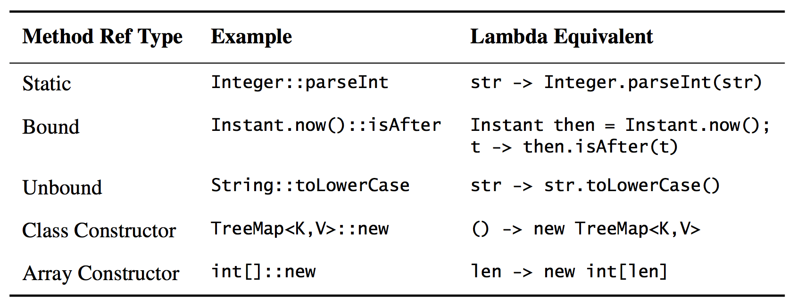

Item 43: Prefer method references to lambdas
============================================

**The primary advantage of _lambdas_ over _anonymous classes_** is that they **are more `succinct`.**
Java provides a way to **generate _function objects_ even more succinct than _lambdas_: _method references_.**

_method references_ usually result in **shorter, clearer code**.
They also give you an out if `a lambda gets too long or complex`:You can **extract the code from the lambda into a new method and replace the lambda with a reference to that method.**

Many _method references_ refer to `static methods`, but there are `four kinds` that do not.
Two of them are **_bound_ and _unbound_ instance method references**.
In `bound references, the receiving object is specified in the method reference.`
Bound references are similar in nature to **static references**: the _function object_ takes the same arguments as the referenced method.
In `unbound references, the receiving object is specified` when the function object is applied, `via an additional parameter before the method’s declared parameters.`
Unbound references are often used as mapping and filter functions in stream pipelines (Item 45).
Finally, there are two kinds of **_constructor references_, for classes and arrays**. Constructor references serve as **factory objects**.
All `five kinds of method references` are summarized in the table below:

In summary, _method references_ often **provide a more `succinct`** alternative to _lambdas_.
**Where _method references_ are `shorter` and `clearer`, use them; where they aren’t, stick with _lambdas_.**

